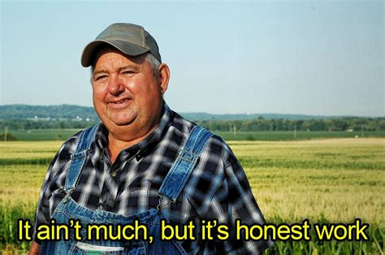

# what is this?

I created this project when I started my web development journey. The idea was to build a translator that could detect untranslated text and offer an option to look it up in a dictionary. Unfortunately, making text detection multilingual has proven to be difficult.

- If I have time, I plan to implement text detection for Latin characters only.

# What dose it do?

For now, it's essentially a Google/Bing translator with three integrated dictionaries.

# How dose it work?

I used Next.js and React (with TypeScript) for the frontend, and Tailwind CSS for the styling.

<!-- The main challenge was dealing with the character limits imposed by Google and Bing Translate APIs. -->

<!-- end. for now! -->
